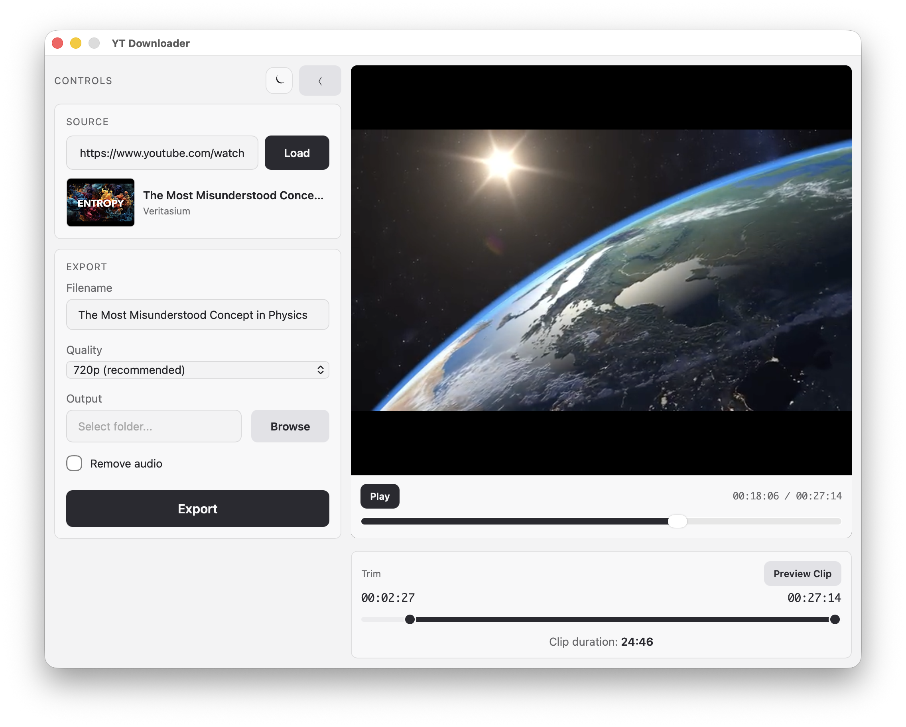

# YT Downloader

## Background

I teach a class at California Men's Colony, where I have no internet access. I needed a way to make my lectures entirely offline, and I like to use videos wherever I can. I had pieced together a number of scripts and hacky solutions to make it work, but after speaking with colleagues who wanted similar functionality, I set out to build this cross-platform, self-contained app. It's designed to make downloading YouTube clips simple. You can keep the audio for narration, but I find it especially useful as a replacement for GIFs—no audio, just a video or animation I can lecture over. The trimming tools are particularly helpful for extracting just the section you want for your slides.

Everything exports to MP4, which plays nicely with PowerPoint. You can set videos to play on click or automatically with looping, replicating GIF behavior but at higher quality and smaller file size.

I recommend 720p, as most projectors max out at this resolution. Of course, if you have the display for it, you can go higher.

## 📥 Download

| Platform | Download |
|----------|----------|
| **macOS (Apple Silicon)** | [Download for Apple Silicon Mac](https://github.com/kylenessen/yt-downloader/releases/latest/download/YT-Downloader-macOS-Apple-Silicon.zip) |
| **macOS (Intel)** | [Download for Intel Mac](https://github.com/kylenessen/yt-downloader/releases/latest/download/YT-Downloader-macOS-Intel.zip) |
| **Windows** | [Download for Windows](https://github.com/kylenessen/yt-downloader/releases/latest/download/YT-Downloader-Windows.zip) |

> **Not sure which Mac you have?** Click  → About This Mac. If the chip says "Apple M1" or higher (M2, M3, etc.), use Apple Silicon. If it says "Intel", use Intel.

### Installation

**macOS:**

1. Download and unzip
2. Drag `YT Downloader.app` to your Applications folder
3. Right-click (or Control-click) the app → select "Open" → click "Open" in the dialog

If you see a message that the app "cannot be opened because the developer cannot be verified":

1. Open **System Settings** → **Privacy & Security**
2. Scroll down to the Security section—you should see a message about "YT Downloader" being blocked
3. Click **Open Anyway**
4. Enter your password if prompted, then click "Open" in the final dialog

> **Why does this happen?** The app is not signed with an Apple Developer certificate. This is a one-time step; after allowing it once, the app will open normally.

**Windows:**

1. Download and unzip
2. Keep `YT Downloader.exe` and `ffmpeg.exe` in the same folder
3. Run `YT Downloader.exe`

## System Requirements

| Platform | Requirements |
|----------|-------------|
| macOS | macOS 11+ (Big Sur or later) |
| Windows | Windows 10+ (64-bit) |
