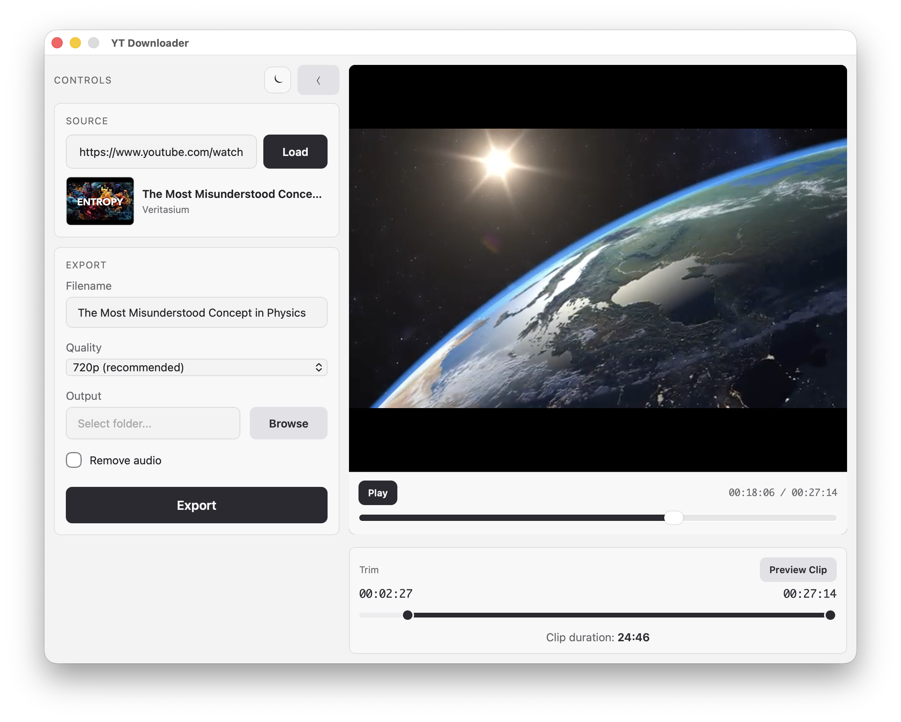

# YT Downloader



YT Downloader is a self-contained desktop app for downloading and trimming YouTube videos into PowerPoint-friendly MP4 clips. It was built for preparing offline classes where internet access is unavailable.

## Download

| Platform | Download |
| --- | --- |
| macOS on Apple Silicon | [Download for Apple Silicon Mac](https://github.com/kylenessen/yt-downloader/releases/latest/download/YT-Downloader-macOS-Apple-Silicon.zip) |
| macOS on Intel | [Download for Intel Mac](https://github.com/kylenessen/yt-downloader/releases/latest/download/YT-Downloader-macOS-Intel.zip) |
| Windows 64-bit | [Download for Windows](https://github.com/kylenessen/yt-downloader/releases/latest/download/YT-Downloader-Windows.zip) |

On macOS, unzip the download and drag `YT Downloader.app` into Applications. On Windows, unzip the download and run `YT Downloader.exe` from the extracted folder.

No Homebrew, Python, FFmpeg, yt-dlp, Deno, or command line setup is required. The release contains everything the app needs. On first launch it verifies and installs its private copy of those tools into the user application support directory.

The macOS release workflow signs and notarizes the app with Apple. A public release should not be published from an ad hoc build.

## How it stays reliable

All YouTube-specific behavior goes through yt-dlp. The app includes a pinned and checksum-verified baseline toolchain. It checks the official yt-dlp nightly channel at most once per day, verifies updates before activation, and retains the previous version for rollback.

If a high-quality download fails because YouTube changed its extractor or challenge behavior, the app updates yt-dlp and retries once before using a lower-quality progressive stream. The interface reports the source and actual preview resolution, so a fallback is visible rather than silent.

Recent diagnostics can be copied from the app if a download fails. Logs contain tool versions and download attempts, but do not contain downloaded media.

## System requirements

| Platform | Requirements |
| --- | --- |
| macOS | macOS 11 or later |
| Windows | Windows 10 or later, 64-bit |

## Development

Install Go 1.23, Node.js, and Wails 2.11. The app does not use tools from `PATH` in production. Build the pinned development toolchain once, then run Wails. Subsequent toolchain builds use the local checksum-addressed download cache.

```bash
scripts/build-toolchain.sh darwin-arm64 build/toolchains/toolchain-darwin-arm64.zip
wails dev
```

Use `darwin-amd64` on an Intel Mac. Wails development builds discover this archive automatically. Explicit tool overrides remain available for toolchain development through `YT_DOWNLOADER_YTDLP`, `YT_DOWNLOADER_FFMPEG`, `YT_DOWNLOADER_FFPROBE`, and `YT_DOWNLOADER_DENO`. All four are required when overrides are used.

Run the checks with the following commands.

```bash
go test ./...
go vet ./...
npm --prefix frontend ci
npm --prefix frontend run build
```

The release architecture and update behavior are documented in [docs/architecture.md](docs/architecture.md). Exact bundled versions and checksums live in [toolchain/manifest.json](toolchain/manifest.json).
